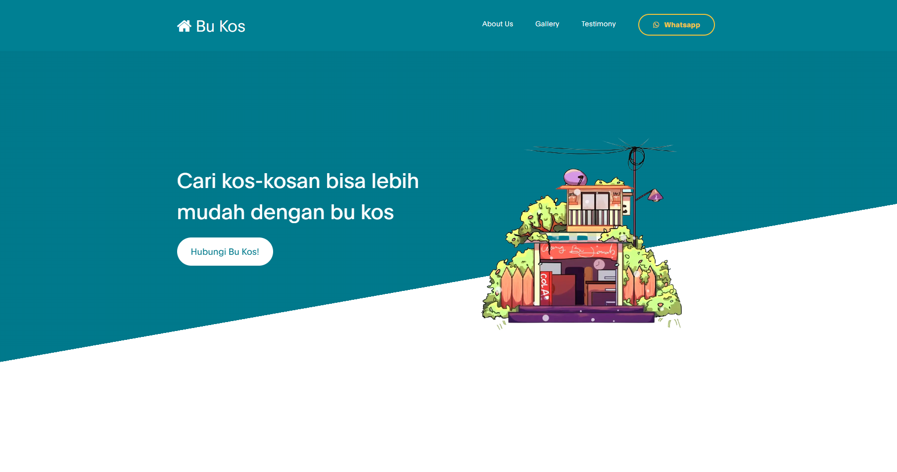
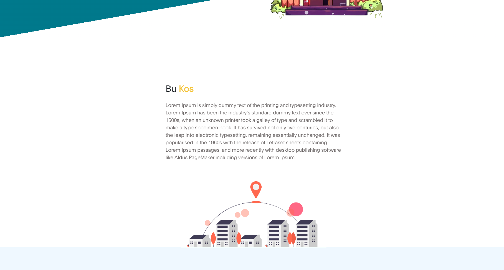
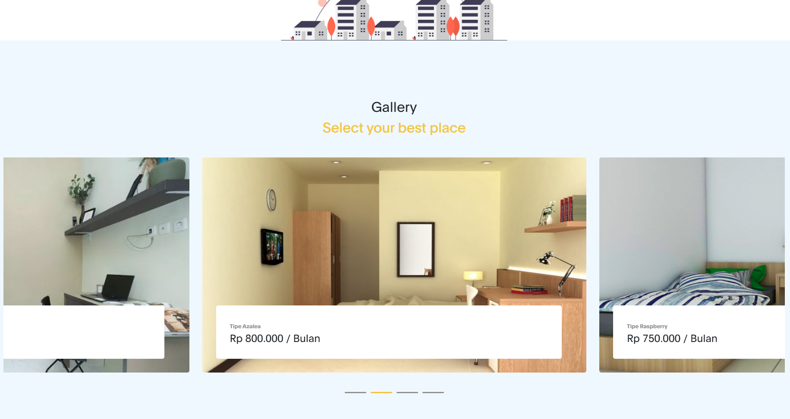
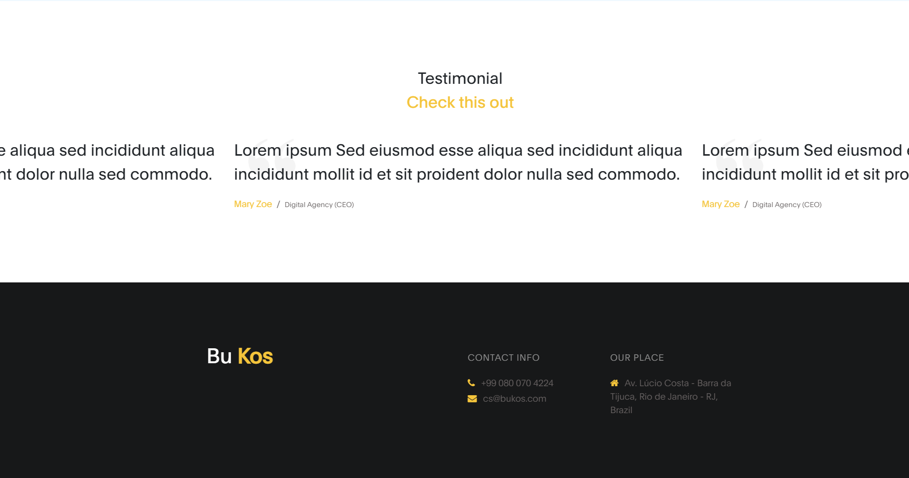

# Bu Kos

Bu Kos merupakan sebuah landing page yang bertujuan mempertemukan customer (pencari kos) dengan kos-kosan yang telah disediakan. Customer dapat dengan mudah menentukan tempat kos-kosan sesuai dengan budget yang ada.

# Live Preview

# Preview

|  |  |
| ----------------------------------------------- | ----------------------------------------------- |
|  |  |

# Installation

> Running index html

# Make it Yours!

1. Persiapan
   Kau harus memiliki PC / Laptop (LOL).

2. Clone Files
   Lakukan cloning ke dengan menjalankan perintah git clone

3. Selesai
